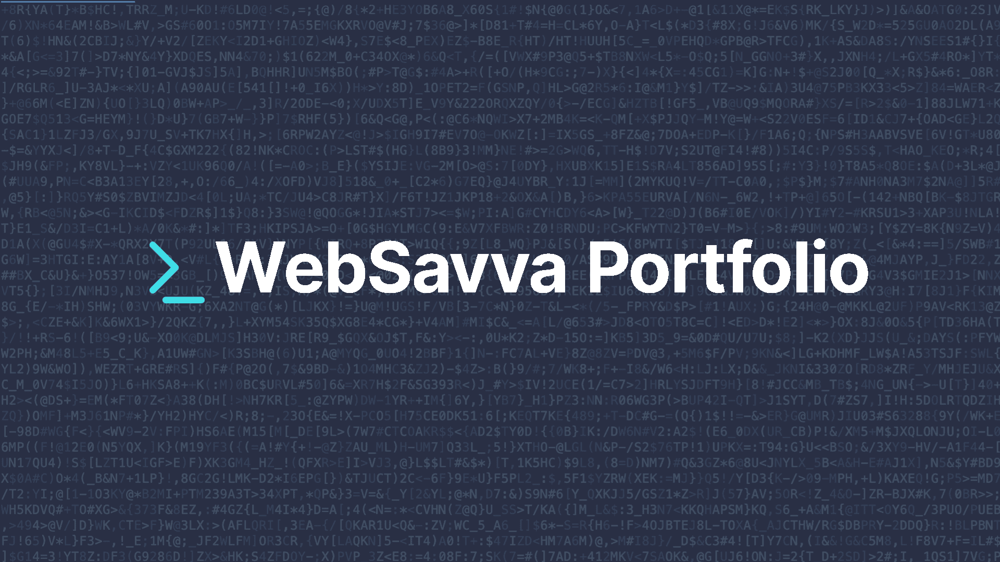

# 🚀 WebSavva Portfolio

**Modern Frontend Developer Portfolio**

_A sleek, interactive portfolio showcasing frontend development expertise with modern technologies and elegant design._

---

## ✨ **About**

This portfolio website represents my journey as a frontend developer, featuring an **interactive VS Code-inspired interface** that showcases my projects, skills, and experience. Built with cutting-edge technologies and designed for performance, accessibility, and user engagement.

### 🎯 **Key Features**

- 🖥️ **VS Code Interface** - Familiar developer environment with file explorer, tabs, and editor
- 🌍 **Internationalization** - Multi-language support (English/Russian)
- 🎨 **Interactive Design** - Smooth animations and engaging user interactions
- 📱 **Responsive Layout** - Optimized for all devices and screen sizes
- ⚡ **Performance Optimized** - Fast loading with SSR and modern optimization techniques
- 🔍 **SEO Friendly** - Structured data and meta optimization
- 📧 **Contact Integration** - Direct contact form with email notifications

---

## 🛠️ **Tech Stack**

### **Frontend**

### **Backend & Infrastructure**

### **Development & Deployment**

---

## 🌟 **Features Showcase**

### **Interactive VS Code Interface**

- File explorer with project navigation
- Tabbed editor interface
- Syntax highlighting for code examples
- Collapsible sidebar panels

### **Project Portfolio**

- Detailed project showcases with live demos
- Technology stack highlights
- GitHub integration
- Interactive project filtering

### **Internationalization**

- English and Russian language support
- Dynamic content loading
- Locale-specific routing
- Cultural adaptations

### **Performance & SEO**

- Server-side rendering (SSR)
- Automatic code splitting
- Image optimization
- Structured data markup
- Open Graph integration

---

**⭐ Star this repository if you found it helpful!**

_Built with ❤️ using modern web technologies_

